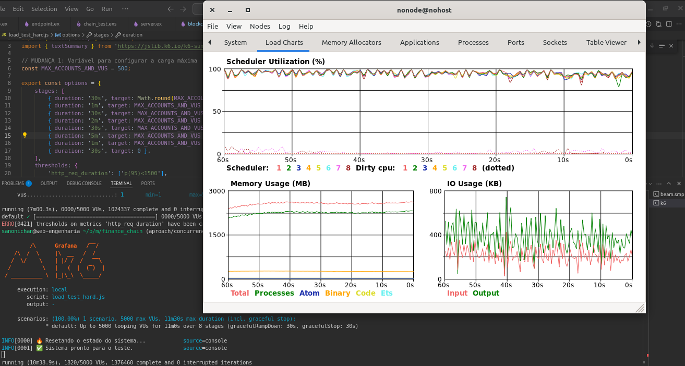

# FinanceChain

Welcome to FinanceChain, a financial API built with Elixir and Phoenix, leveraging blockchain principles and OTP (Open Telecom Platform) for concurrency and fault tolerance.


---

## How to Start Your Phoenix Server

* Install dependencies with `mix deps.get`
* Start Phoenix endpoint with `mix phx.server` or inside IEx with `iex -S mix phx.server`

Now you can visit [`localhost:4000`](http://localhost:4000) from your browser.

Ready to run in production? Please [check our deployment guides](https://hexdocs.pm/phoenix/deployment.html).

---
## Load Test 
```bash
k6 run load_test_hard.js
k6 run load_test.js
```

## Test
```bash
mix test
```


## Project Overview & Motivation

This project aims to provide a robust financial API capable of handling basic banking operations like deposits, withdrawals, and transfers. The core challenge was to build a system that could manage financial accounts with high **concurrency**, **reliability**, and **data integrity**.

Inspired by the principles of **blockchains** and the inherent strengths of **Elixir/Erlang's OTP**, this solution models each account as an independent, concurrent process (a `GenServer`) maintaining its own mini-blockchain. This approach leverages OTP's "let it crash" philosophy and supervision trees to build a highly fault-tolerant system where account operations can happen in parallel.

Understanding Elixir/Erlang's concurrency model and applying blockchain theory were crucial for this implementation.

---

## Architectural Philosophy

FinanceChain is built upon the following core tenets:

* **Concurrency with GenServers:** Each financial account is managed by its own `FinanceChain.BlockChain.AccountServer` GenServer. This allows for concurrent operations on different accounts without contention.
* **Blockchain per Account:** Instead of a single global blockchain, each `AccountServer` maintains its own dedicated blockchain (a `FinanceChain.BlockChain.Chain` instance) which records all transactions related to that specific account. This design simplifies state management for individual accounts and localizes transaction history.
* **Supervision Trees (OTP):** The system's robustness comes from OTP's supervision capabilities. Supervisors automatically restart failed processes, ensuring high availability.
* **Registry for Process Discovery:** The `Registry` is used to efficiently map `account_id`s to their corresponding `AccountServer` process IDs (PIDs), enabling quick lookup and communication.

---

## Core Components

This section details the main modules and their responsibilities within the FinanceChain system.

### `FinanceChain.Application`

This is the main application module and defines the **supervision tree** for all crucial components. It ensures that critical processes like the `Registry` and the `DynamicSupervisor` for accounts are started and managed correctly.

* **`FinanceChain.Registry`**: A key component that acts as a lookup table, associating each `account_id` (e.g., `100`, `200`) with the PID of its dedicated `AccountServer` process. This allows other parts of the application to find and communicate with specific account processes without knowing their PIDs directly.
* **`FinanceChain.AccountSupervisor`**: A `DynamicSupervisor` that is responsible for dynamically starting, stopping, and restarting `FinanceChain.BlockChain.AccountServer` processes as accounts are accessed or created. This allows for efficient resource management, as account processes are only spawned when needed.
* **Phoenix Endpoint**: The web server interface that handles incoming HTTP requests.

### `FinanceChainWeb.EventController`

This module acts as the **API gateway** for the system. It receives HTTP requests (deposits, withdrawals, transfers, balance queries) and translates them into calls to the core `FinanceChain.BlockChain` logic. It is responsible for handling request parameters, invoking the appropriate blockchain functions, and formatting the HTTP responses (status codes and JSON payloads).

### `FinanceChain.BlockChain`

This module serves as the **public API** for interacting with the financial system. It orchestrates interactions with the individual `FinanceChain.BlockChain.AccountServer` processes. It contains the business logic for:

* **`get_balance/1`**: Retrieves the balance of a specified account.
* **`deposit/1`**: Handles the logic for adding funds to an account, finding or starting the destination `AccountServer`, and adding the transaction.
* **`withdraw/1`**: Manages the withdrawal process, including checking for sufficient funds before adding the transaction to the origin account.
* **`transfer/1`**: Orchestrates the transfer of funds between two accounts, including balance checks and coordinating transactions on both the origin and destination `AccountServer`s.
* **`reset/0`**: A utility function (primarily for testing/development) that resets the entire system by terminating and restarting the `AccountSupervisor`, effectively clearing all account data.
* **Internal Helpers (`find_account_server`, `find_or_start_account_server`):** Functions to locate or initiate `AccountServer` processes using the `Registry` and `DynamicSupervisor`.

### `FinanceChain.BlockChain.AccountServer`

This is a `GenServer` module, where **each instance manages a single financial account's blockchain**. When an account is accessed, an `AccountServer` process is started (if not already running) and maintains the transaction history (`FinanceChain.BlockChain.Chain`) for that specific account in its state.

* It handles requests to get the account's balance (`handle_call(:get_balance)`) and to add new transactions (`handle_cast({:add_transaction, wallet})`).
* **Caching Opportunity**: This is the ideal place to implement caching for account balances. By storing the current balance directly in the `GenServer`'s state and updating it with each new transaction, balance queries can become `O(1)` operations, significantly improving performance for frequently accessed accounts.

### `FinanceChain.BlockChain.Wallet`

This module defines the **data structure for a single financial transaction (a "wallet")**. It captures key details of a movement of funds:

* `origin`: The ID of the account from which funds are moved (or `0` for system-generated deposits).
* `destination`: The ID of the account to which funds are moved (or `0` for system-generated withdrawals).
* `amount`: The value of the transaction.
* `signature`: A descriptive string indicating the type of transaction (e.g., "deposit", "withdraw", "transfer", "GENESIS").

### `FinanceChain.BlockChain.Block`

This module defines the **structure of a single block within a blockchain**. Each block encapsulates a single transaction (`Wallet`) and cryptographic information to link it to the previous block:

* `timestamp`: When the block was created.
* `last_hash`: The SHA256 hash of the previous block in the chain.
* `hash`: The SHA256 hash of the current block, calculated from its content.
* `data`: The `Wallet` struct representing the transaction stored in this block.
* It provides functions for creating new blocks (`new/3`), generating the genesis block (`genesis/0`), and "mining" new blocks (`mine_block/2`) by calculating their hash.

### `FinanceChain.BlockChain.Chain`

This module defines the **blockchain data structure** itself (a list of `FinanceChain.BlockChain.Block`s) and provides core functions for manipulating it:

* **`new/0`**: Creates a new blockchain instance, initialized with a `genesis` block.
* **`add_block/2`**: Appends a new block containing transaction data to the chain.
* **`total_amount/2`**: Calculates the cumulative balance for a specific account by iterating through all blocks in the chain and summing/subtracting transaction amounts. (This is the operation that heavily benefits from caching).
* **`all_accounts/1`**: Identifies all unique account IDs that have ever participated in a transaction on this chain.
* **`valid_chain?/1`**: Verifies the integrity of the blockchain by checking if block hashes and `last_hash` references are correct.

### `FinanceChain.BlockChain.Server` & `FinanceChain.BlockChain.Supervisor`

These modules appear to set up a global `GenServer` (`FinanceChain.BlockChain.Server`) and its supervisor. In the current design, where each `AccountServer` maintains its own `Chain` for balance calculations, this global server is not actively used for individual account financial operations. It could potentially serve as:

* A **global log** of all transactions across all accounts.
* A **canonical chain** that aggregates and validates transactions from all individual account blockchains, if such a global consistency layer were desired in a more complex setup.
* A starting point for a system where a single blockchain records all events, rather than per-account chains.

Currently, `AccountServer`s are the primary holders of account-specific transaction history relevant to balances.

---

## API Endpoints & Usage Examples

The `FinanceChainWeb.EventController` exposes the following endpoints:

* **`POST /reset`**
    * **Description**: Resets the entire system state, clearing all accounts and their transaction histories. Primarily for development and testing.
    * **Response**: `200 OK` with text "OK"
    * **Example**:
        ```
        POST /reset
        200 OK
        ```

* **`GET /balance?account_id={id}`**
    * **Description**: Retrieves the current balance for a specified account.
    * **Parameters**: `account_id` (query parameter)
    * **Response**:
        * `200 OK` with the balance (e.g., `20`) if the account exists.
        * `404 Not Found` with `0` if the account does not exist.
    * **Examples**:
        ```
        GET /balance?account_id=1234
        404 0

        GET /balance?account_id=100
        200 20
        ```

* **`POST /event` (type: `deposit`)**
    * **Description**: Creates a new account with an initial balance or adds funds to an existing account.
    * **Body**: `{"type":"deposit", "destination":"{account_id}", "amount":{amount}}`
    * **Response**: `201 Created` with the updated destination account's balance.
    * **Examples**:
        ```
        POST /event {"type":"deposit", "destination":"100", "amount":10}
        201 {"destination": {"id":"100", "balance":10}}

        POST /event {"type":"deposit", "destination":"100", "amount":10}
        201 {"destination": {"id":"100", "balance":20}}
        ```

* **`POST /event` (type: `withdraw`)**
    * **Description**: Withdraws funds from an existing account.
    * **Body**: `{"type":"withdraw", "origin":"{account_id}", "amount":{amount}}`
    * **Response**:
        * `201 Created` with the updated origin account's balance on success.
        * `404 Not Found` with `0` if the origin account does not exist.
        * `422 Unprocessable Entity` with `{"error": "insufficient funds"}` if funds are insufficient.
    * **Examples**:
        ```
        POST /event {"type":"withdraw", "origin":"200", "amount":10}
        404 0

        POST /event {"type":"withdraw", "origin":"100", "amount":5}
        201 {"origin": {"id":"100", "balance":15}}
        ```

* **`POST /event` (type: `transfer`)**
    * **Description**: Transfers funds from an origin account to a destination account.
    * **Body**: `{"type":"transfer", "origin":"{origin_id}", "amount":{amount}, "destination":"{destination_id}"}`
    * **Response**:
        * `201 Created` with updated balances for both origin and destination accounts on success.
        * `404 Not Found` with `0` if the origin account does not exist.
        * `422 Unprocessable Entity` with `{"error": "insufficient funds"}` if funds are insufficient.
        * `422 Unprocessable Entity` with `{"error": "cannot transfer to the same account"}` if origin and destination are identical.
    * **Examples**:
        ```
        POST /event {"type":"transfer", "origin":"100", "amount":15, "destination":"300"}
        201 {"origin": {"id":"100", "balance":0}, "destination": {"id":"300", "balance":15}}

        POST /event {"type":"transfer", "origin":"200", "amount":15, "destination":"300"}
        404 0
        ```

---

## Areas for Future Improvements

While functional, this system can be significantly enhanced for production environments:

* **Atomic Transfers**: Implement a robust mechanism (e.g., Two-Phase Commit) to ensure that transfers are "all or nothing" operations, preventing inconsistencies if one part of the transfer fails.
* **Data Persistence**: Integrate a database (like DETS, Mnesia, or a traditional RDBMS/NoSQL) to persist account blockchains, preventing data loss on application restarts or crashes.
* **Real Cryptographic Signatures**: Enhance the `Wallet` `signature` field to use actual cryptographic signatures (public/private key pairs) for transaction authentication and integrity verification.
* **Authentication & Authorization**: Implement user authentication for API access and authorization rules to restrict operations to account owners.
* **Error Handling & Idempotency**: Provide more granular error messages and ensure operations are idempotent to handle retries safely.
* **Scalability**: Explore strategies for distributing `AccountServer` processes across multiple BEAM nodes for horizontal scaling.
* **Monitoring & Observability**: Add metrics collection and structured logging for better operational visibility.

---

## Contributing

We welcome contributions! If you find any errors, please report them in the [ISSUES](link-to-your-issues-page-if-any) section.